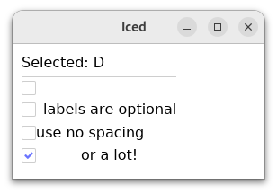

# Iced Extensions

Small QoL improvements some Iced Widgets.

---

### Square Radio Button
Because Circles are for Squares!

Provides the look and feel of a Checkbox with the behavior of a Radio Button.

```rust
fn view(&self) -> iced::Element<'_, Message> {
    column![
        text(format!("Selected: {}", self.selection())),
        rule::horizontal(0.5),
        SquareRadio::new(Letter::A, self.letter, Message::Letter)),
        SquareRadio::new(Letter::B, self.letter, Message::Letter).label("labels are optional!"),
        SquareRadio::new(Letter::C, self.letter, Message::Letter).label("use no spacing").spacing(0),
        SquareRadio::new(Letter::D, self.letter, Message::Letter).label("or a lot!").spacing(50),
    ]
    .width(Length::Shrink)
    .spacing(5)
    .padding(10)
    .into()
}
```



### Progress Bar Ext
Show the current progress bar percentage aligned Left, Center, or Right (horizontally)
